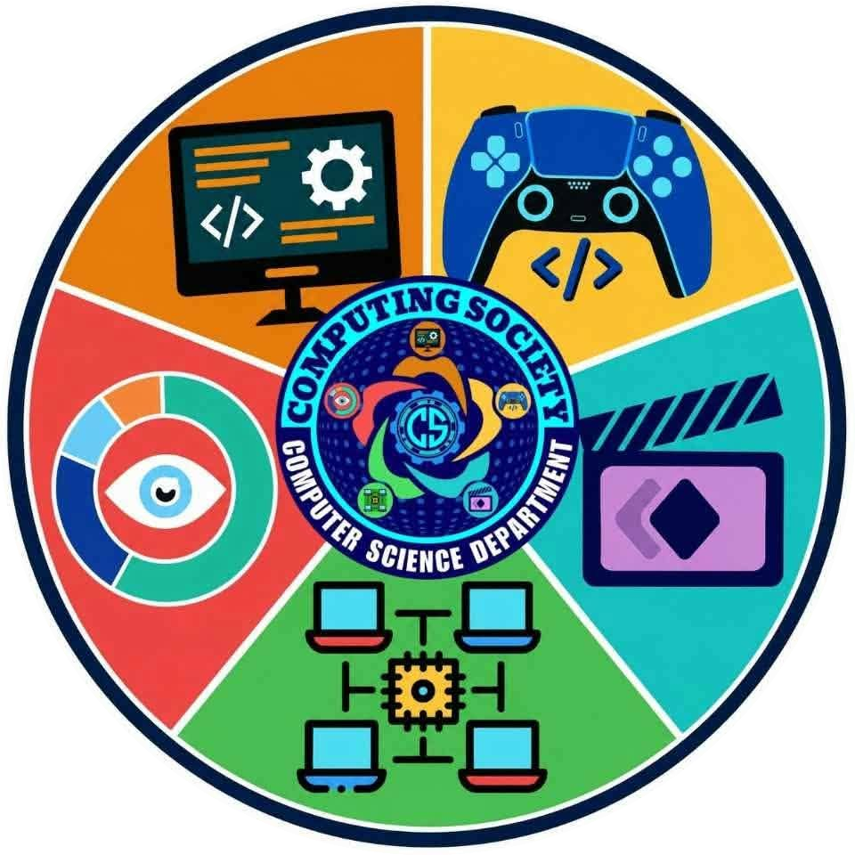
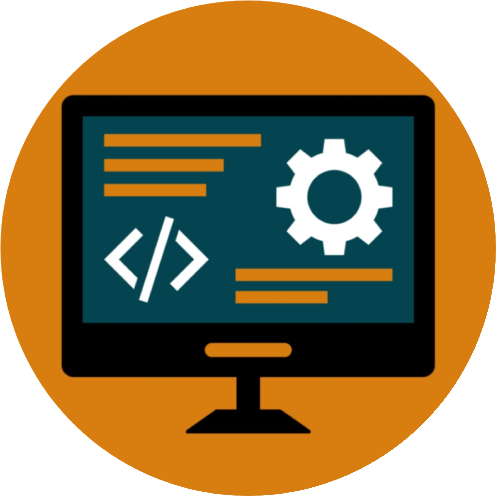
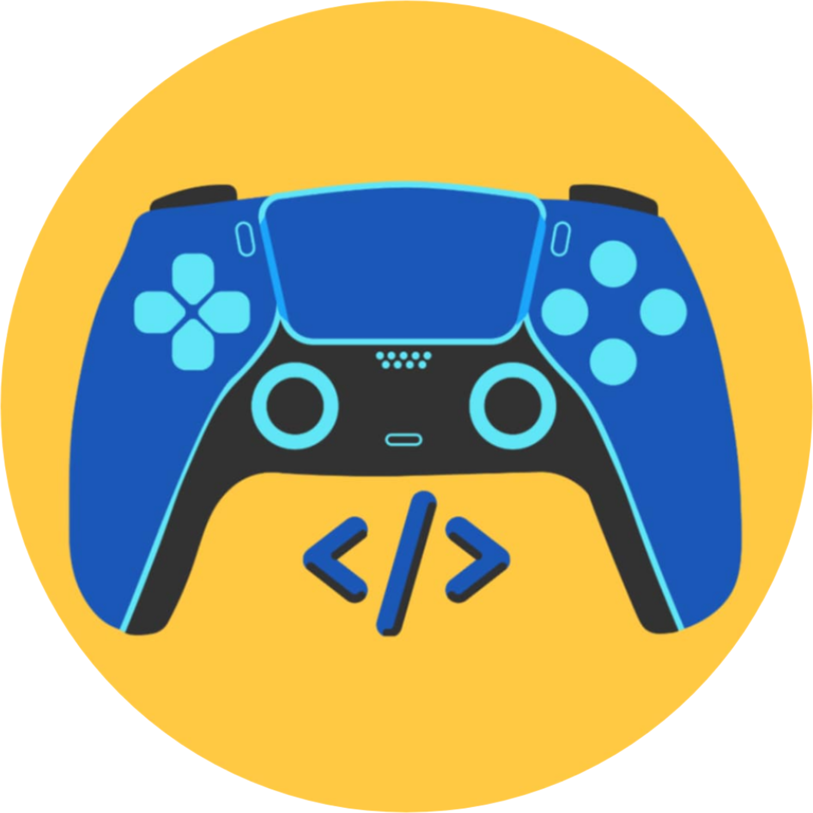
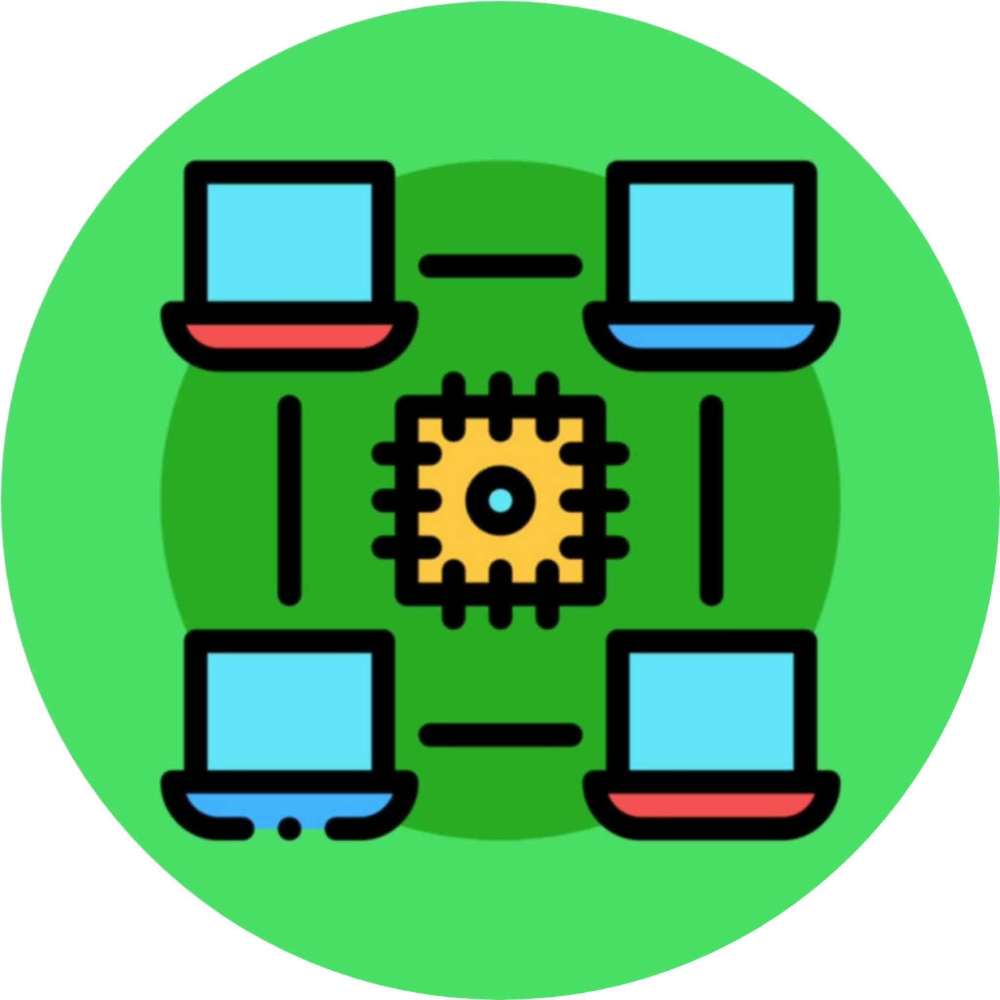
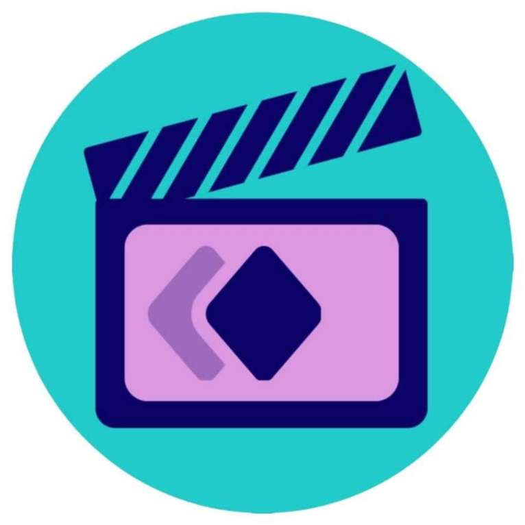
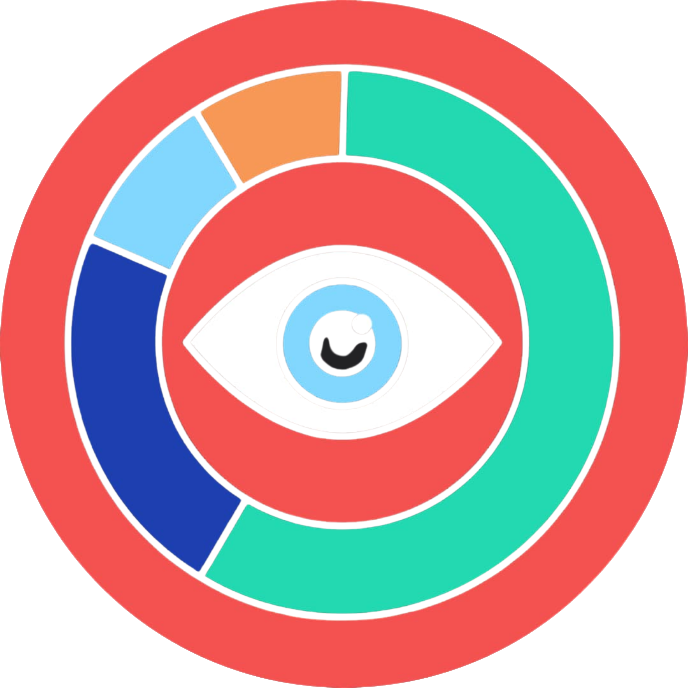

  

  

  <h1>OIC</h1>
  <h3>Fullstack Masters · Game Development · Networking Geeks · Animedia · Data Visualizers</h3>
  
<strong>Five communities. One passion for computing. Building, creating and learning together.</strong>

  

  

    
    
    
    
    
  

---

## About OIC

**OIC** is a student-and-faculty-driven community that brings together five specialized groups under one shared mission: to **learn, build and create with technology**. Each group focuses on a distinct discipline of computing, yet all of them collaborate — a game needs networking and data, a dashboard needs a full-stack backend, and every product needs great design and media.

- 🎓 Hands-on learning through projects, workshops, mentorship and peer teaching
- 🛠️ Real, deployable software, media and systems — not just classroom exercises
- 🤝 Cross-group collaboration on interdisciplinary, community-centered projects
- 🌱 An inclusive space for beginners and experts to grow together
- 🔬 Responsible, ethical and human-centered use of technology

---

## Our Groups

<table align="center">
  <tr>
    <td align="center" width="20%">
       
      <b>Fullstack Masters</b> 
      End-to-end web, mobile and API engineering
    </td>
    <td align="center" width="20%">
       
      <b>Game Development</b> 
      Interactive experiences, engines and gameplay engineering
    </td>
    <td align="center" width="20%">
       
      <b>Networking Geeks</b> 
      Networks, systems, security and infrastructure
    </td>
    <td align="center" width="20%">
       
      <b>Animedia</b> 
      Animation, multimedia and digital storytelling
    </td>
    <td align="center" width="20%">
       
      <b>Data Visualizers</b> 
      Data analytics, visualization and insight communication
    </td>
  </tr>
</table>

| Group | Focus | Core Technologies |
|---|---|---|
|  **Fullstack Masters** | Web, mobile & API engineering | React · Next.js · Node.js · Django · Laravel · SQL/NoSQL · Docker |
|  **Game Development** | Game design, engines & real-time graphics | Unity · Unreal · Godot · C# · C++ · Blender |
|  **Networking Geeks** | Networks, systems, cloud & security | Linux · Kubernetes · Ansible · Terraform · AWS/Azure/GCP |
|  **Animedia** | Animation, multimedia & UI/UX | After Effects · Premiere · Photoshop · Illustrator · Figma · Blender |
|  **Data Visualizers** | Analytics, ML & dashboards | Python · R · D3.js · TensorFlow · PyTorch · Grafana |

---

  
  
  <h2>Fullstack Masters</h2>
  

Fullstack Masters is the engineering core of OIC. Members design, build and ship complete software products — from responsive user interfaces and secure REST/GraphQL APIs to relational and NoSQL data layers and automated deployments. The group emphasizes clean architecture, maintainable code, version control discipline and real-world delivery.

<table>
  <tr>
    <td valign="top" width="50%">

**🎯 Focus Areas**

- Web application development (frontend + backend)
- API design, authentication and system integration
- Database modeling and performance
- Cloud deployment, containers and CI/CD
- Code review, testing and software-engineering best practices

    </td>
    <td valign="top" width="50%">

**🚀 What We Build**

- Production-ready web platforms and dashboards
- Mobile-friendly progressive web apps and companion apps
- Reusable component libraries and API services
- Institutional and community information systems

    </td>
  </tr>
</table>

**🧰 Fullstack Masters Toolkit**

  

---

  
  
  <h2>Game Development</h2>
  

The Game Development group turns code, art and storytelling into playable experiences. Members explore game design, gameplay programming, real-time graphics, physics and audio integration across 2D and 3D engines, and learn the full production pipeline from prototype to polished build.

<table>
  <tr>
    <td valign="top" width="50%">

**🎯 Focus Areas**

- Gameplay programming and game-loop architecture
- 2D/3D engines, physics, AI behaviors and tooling
- Level design, game design documents and prototyping
- Asset pipelines: art, animation, audio and optimization
- Game jams, playtesting and iterative production

    </td>
    <td valign="top" width="50%">

**🚀 What We Build**

- 2D and 3D games for desktop, web and mobile
- Educational and serious games
- Interactive simulations and prototypes
- Reusable gameplay systems and tools

    </td>
  </tr>
</table>

**🧰 Game Development Toolkit**

  

---

  
  
  <h2>Networking Geeks</h2>
  

Networking Geeks is OIC's infrastructure and systems group. Members study how data moves, how systems stay available and how networks are secured — from protocols and routing fundamentals to Linux administration, virtualization, cloud infrastructure, IoT and cybersecurity practice in controlled lab environments.

<table>
  <tr>
    <td valign="top" width="50%">

**🎯 Focus Areas**

- Network design, protocols, routing and switching
- Linux/Windows server administration and scripting
- Virtualization, containers and cloud infrastructure
- Cybersecurity fundamentals and ethical hacking labs
- Monitoring, automation and IoT/embedded systems

    </td>
    <td valign="top" width="50%">

**🚀 What We Build**

- Lab networks and simulated topologies
- Automation scripts and infrastructure-as-code
- Self-hosted services and monitoring dashboards
- IoT and embedded prototypes

    </td>
  </tr>
</table>

**🧰 Networking Geeks Toolkit**

  

---

  
  
  <h2>Animedia</h2>
  

Animedia brings creativity and technology together. The group covers 2D/3D animation, motion graphics, video production, sound design, UI/UX and interactive media, helping members craft visual stories and polished digital content for campaigns, education, culture and entertainment.

<table>
  <tr>
    <td valign="top" width="50%">

**🎯 Focus Areas**

- 2D/3D animation and motion graphics
- Video editing, audio production and sound design
- UI/UX, branding and visual identity
- Interactive and creative-coding experiences
- Storyboarding, scripting and digital storytelling

    </td>
    <td valign="top" width="50%">

**🚀 What We Build**

- Animated shorts, explainers and promotional videos
- Brand kits, posters and social-media content
- Interactive web experiences and portfolios
- Multimedia content for events and campaigns

    </td>
  </tr>
</table>

**🧰 Animedia Toolkit**

  

---

  
  
  <h2>Data Visualizers</h2>
  

Data Visualizers transforms raw data into clear, decision-ready insight. Members practice data collection and cleaning, statistical analysis, machine learning and — above all — visual storytelling through charts, dashboards and interactive reports that make complex information accessible to everyone.

<table>
  <tr>
    <td valign="top" width="50%">

**🎯 Focus Areas**

- Data wrangling, cleaning and exploratory analysis
- Statistics, machine learning and predictive modeling
- Dashboard and interactive-chart design
- Data pipelines, APIs and databases
- Responsible, ethical and accessible data communication

    </td>
    <td valign="top" width="50%">

**🚀 What We Build**

- Interactive dashboards and analytics portals
- Open-data explorers and infographics
- ML-assisted analysis notebooks and reports
- Data services and REST APIs for visualization

    </td>
  </tr>
</table>

**🧰 Data Visualizers Toolkit**

  

---

## How We Work

| Principle | What it means |
|---|---|
| 📚 **Learn by building** | Every concept is applied to a real project, prototype or experiment. |
| 🔁 **Iterate openly** | We use Git, code review, issues and demos to improve continuously. |
| 🤝 **Collaborate across groups** | Full-stack, games, networks, media and data teams ship together. |
| 🧭 **Mentor and share** | Experienced members guide newcomers; knowledge is documented and shared. |
| ✅ **Build responsibly** | Quality, security, accessibility and ethics are part of the definition of done. |

---

## Complete Technology Universe

OIC members work across the entire technology landscape. Below is the **complete** [skillicons.dev](https://skillicons.dev) icon set, organized by domain.

### 💻 Programming Languages (39)

  

### 🎨 Markup, Styling & UI Kits (16)

  

### 🌐 Frontend, Web Platforms & Creative Coding (25)

  

### ⚙️ Backend, APIs & Messaging (26)

  

### 🗄️ Databases & Backend-as-a-Service (12)

  

### 🧠 AI, Machine Learning & Data Science (5)

  

### 📱 Mobile & Desktop Development (6)

  

### 🎮 Game Engines, 3D & CAD (10)

  

### 🎬 Design, Motion & Audio (8)

  

### ☁️ Cloud, DevOps & Observability (21)

  

### 🌐 Operating Systems, Networking & Hardware (15)

  

### 🛠️ Editors & IDEs (15)

  

### 📦 Build Tools, Testing & Package Managers (17)

  

### 🤝 Version Control, Community & Collaboration (21)

  

> **236 technology icons** in total — languages, frameworks, databases, AI/ML, game engines, design tools, cloud, DevOps, operating systems, editors and more.

<b>⚡ Every icon in one wall (click to expand)</b>

 

  

---

## Join the Community

Whether you are a beginner writing your first line of code or an experienced developer, designer or analyst, there is a place for you in OIC.

1. 🔍 Pick the group that excites you — or join several.
2. 💬 Introduce yourself and share what you want to learn or build.
3. 🧪 Join a project, workshop or challenge.
4. 🚀 Ship something, document it and help the next member.

<!-- TODO: replace the placeholders below with OIC's real contact links -->

  

<!-- Wavy Footer -->
<picture>
  <source media="(prefers-color-scheme: dark)" srcset="https://capsule-render.vercel.app/api?type=waving&color=gradient&customColorList=6,11,20&height=140&section=footer&animation=twinkling" />
  
</picture>
